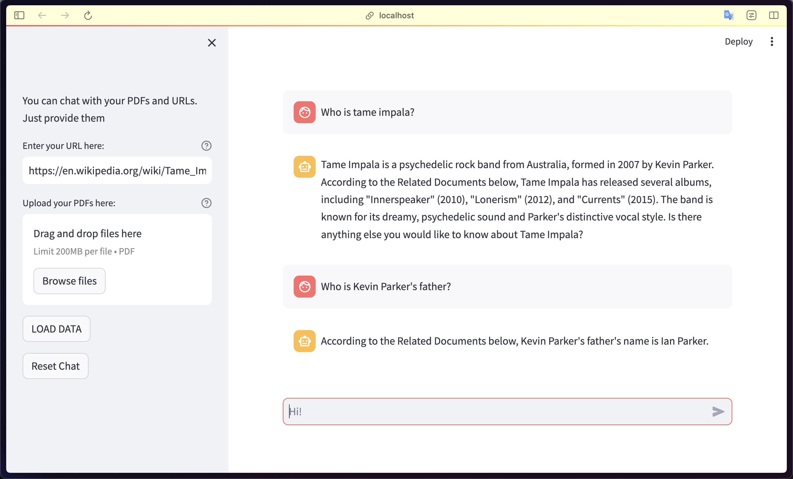
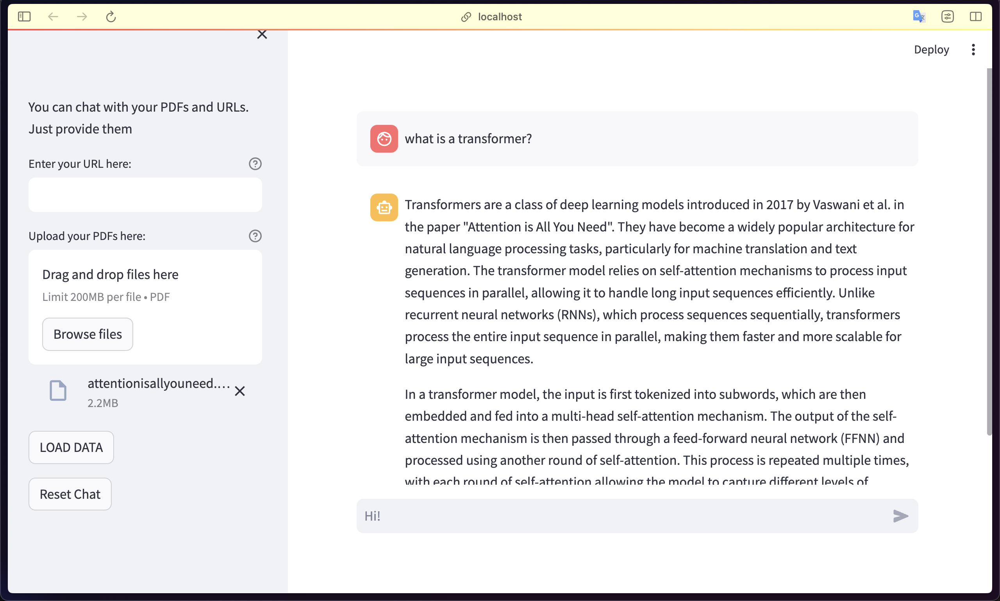

# rag-with-local-model

## Overview

This repository contains a Retriever-Augmented Generation (RAG) system, designed to leverage the power of local LLama models using Ollama for efficient and effective inference. The system uniquely accepts both PDF documents and URLs as input sources. It integrates [LangChain](https://python.langchain.com/docs/get_started/introduction) — a **great library** for which we're so much thankful — for vector storage and retrieval tasks, enhancing the system's ability to fetch relevant information accurately and efficiently.

> **Note/Adventage:** All inferences are processed locally on your computer. This ensures no data leakage and maintains high standards of data privacy.

Additionally, the system features a user-friendly Streamlit interface for easy interaction. The RAG approach combines the abilities of a retriever model to fetch relevant information and a generator model to create coherent and contextually accurate responses.

## Features

- **Local Model Support:** Designed to seamlessly integrate with LLama-7b-chat model. Use [Ollama](https://ollama.ai/) to download the model.
- **Streamlit Interface:** Features a user-friendly Streamlit interface, allowing easy interaction and navigation through the system’s capabilities.to
- **Efficient Inference:** Optimized for fast response times while maintaining high-quality outputs.
- **Customizable Input Sources:** The system is uniquely designed to accept both PDF documents and URLs as input, catering to a wide range of data sources for inference.

## Getting Started

### Prerequisites

- Python 3.11 or later.
- [Poetry](https://python-poetry.org/) for dependency management.
- [Ollama](https://ollama.ai/) for LLama model.
- [GPT4All](https://gpt4all.io/index.html) for embedding.

### Installation

1. Clone the repository:

```bash
   git clone https://github.com/baburyx/rag-with-local-model.git
```

2. Install [Poetry](https://python-poetry.org/).
3. Install required packages:

```bash
poetry install --no-root
```

4. Lastly, start the application

```bash
poetry run streamlit run app.py
```

## Examples




## Contributing

Pull requests are welcome. For major changes, please open an issue first
to discuss what you would like to change.

## License

[MIT](https://choosealicense.com/licenses/mit/)
